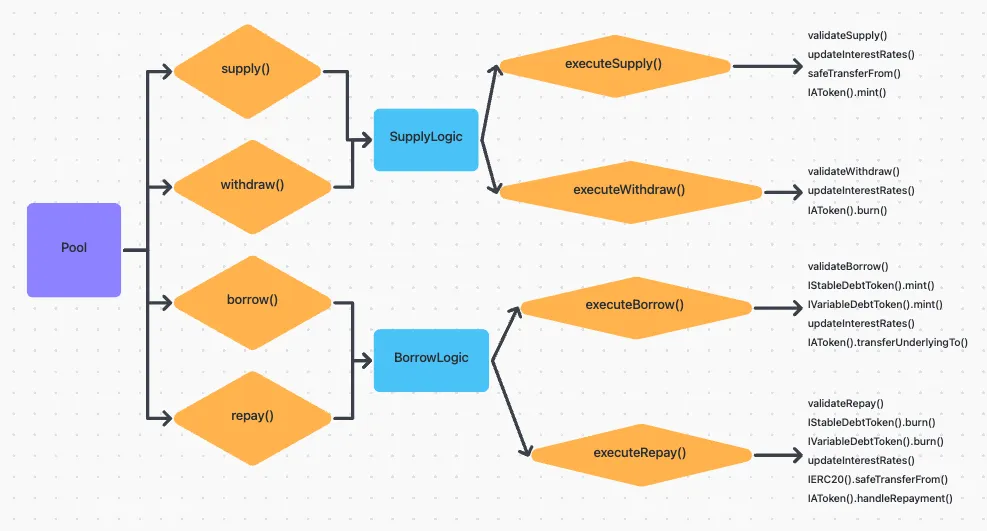

# AAVE Code Explained Part 1
Aave is a decentralized non-custodial liquidity market protocol where users can participate as suppliers or borrowers.

## Suppliers & Borrowers
Suppliers provide liquidity to the market and earn a passive income, while borrowers are able to borrow unexpected expenses, leveraging their holding.

Liquidity is at the heart of the Aave Protocol as it enables the protocol's operation and user experience.

The liquidity of the protocol is measured by the availability of assets for basic protocol operations such as borrowing of assets backed by collateral and claiming of supplied assets along with accrued yield.
- A lack of liquidity will block operations.

## Contracts Overview
The Aave Porotocol V3 contracts are divided into two repositories
1. aave-v3-core
2. aave-v3-periphery

### aave-v3-core
The aave-v3-core host or contains the core protocol V3 contracts that contains the logic for supply, borrow, liquidation, flashloans, a/s/v tokens, portal, pool configuration, oracles and interest rate strategies.

The core protocol contracts fall in the following 4 categories:
- Configuration
- Pool Logic
- Tokenization
- Misc

### aave-v3-periphery
In the periphery repository, you will find the contracts related towards rewards, UI data provider, wallet balance provider and WETH gateway.

The periphery contracts have two categories
- Rewards
- Misc

## What can we do with Aave Protocol
- Supply and Earn:
By supplying you will earn passive income based on the market borrowing demand

- Borrow:
Additionally, supplying assets allows you to borrow by using your supplied assets as a collateral


### Pool.sol Smart Contract
The Pool.sol contract is the main user facing contract of the protocol. It exposes the liquidity management methods.

The Pool.sol is owned by the PoolAddressedProvider of the specific market.

All admin functions are callable by the PoolConfigurator contract, which is defined in the PoolAddressesProvider.



It is worth mentioning here that in the Pool.sol contract itself, it will mainly be calling to either internal functions such as:
- executeSupply() which is inside the SupplyLogic.sol or
- libraries like DataTypes which holds and stores the function's main parameters in structs.

### funtion supply()
The supply() function supplies an amount of underlying asset into the reserve, receiving in return overlying aTokens. These aTokens serves as a receipt that a user supplied assets to the pool.

Eg: User supplies 100 USDC and gets in return 100 aUSDC
```
function supply(
  address asset, 
  uint256 amount, 
  address onBehalfOf, 
  uint16 referralCode
) external;
```
- asset: address of the asset being supplied to the pool
- amount: amount of asset being supplied to the pool
- onBehalfOf: address that will receive the corresponding aTokens. Note: Only the onBehalfOf address will be able to withdraw asset from the pool
- referralCode: unique code for 3rd party referral program integration. Use 0 (zero) for no referral.

Inside the function we are going to find only the call to an internal function executeSupply() which is inside SupplyLogic.sol:

```
SupplyLogic.executeSupply(
  _reserves,
  _reservesList,
  _usersConfig[onBehalfOf],
  DataTypes.ExecuteSupplyParams({
    asset: asset,
    amount: amount,
    onBehalfOf: onBehalfOf,
    referralCode: referralCode
  })
);
```

You will notice DataTypes.ExecuteSupplyParams() call inside the above function's parameter. It is simply passing a list of parameters wrapped in a struct.

Now let's look into the executeSupply() function found in the SupplyLogic.sol contract. We can split it in three parts:
- The updates and validation:
```
reserve.updateState(reserveCache);

ValidationLogic.validateSupply(reserveCache, reserve, params.amount);

reserve.updateInterestRates(reserveCache, params.asset, params.amount, 0);
```

- From the code above, the first function resereve.updateState(reserveCache) will update the reserves with the provided reserveData from the specific asset passed as argument.

- Right after it, it will pass this data to validation where the main checks will be this asset fulfils the following:

```
require(isActive, Errors.RESERVE_INACTIVE);
require(!isPaused, Errors.RESERVE_PAUSED);
require(!isFrozen, Errors.RESERVE_FROZEN);
```

The above checks is inside th validateSupply() function found in the ValidationLogic.sol

- The last thing is to update the interest rates with the updateInterestRates() function, which receives as parameters, the reserves cached, the specific asset and the amount of the asset.

- The main action of the function is where the supply of the ERC20 token is done, by using the safeTransferFrom function and the mint of aTokens. See the code below:
```
IERC20(params.asset).safeTransferFrom(msg.sender, reserveCache.aTokenAddress, params.amount);
```

```
IAToken(reserveCache.aTokenAddress).mint(msg.sender, params.onBehalfOf, params.amount, reserveCache.nextLiquidityIndex);
```

- Setting the Collateral Value
This will only happen if this is the first time the sender is making a supply. That is why in the code you will see a condition ~isFirstSupply~ The validation before modifying anything and finally the setter.